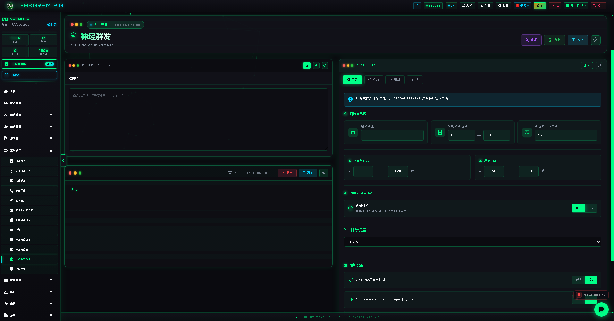
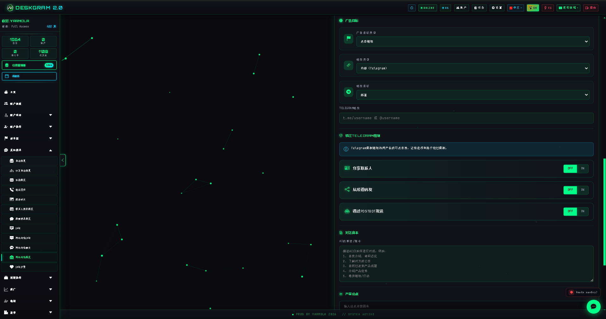
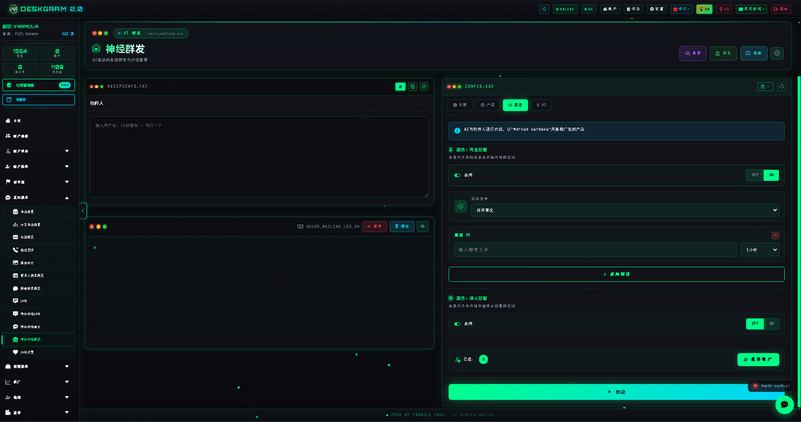
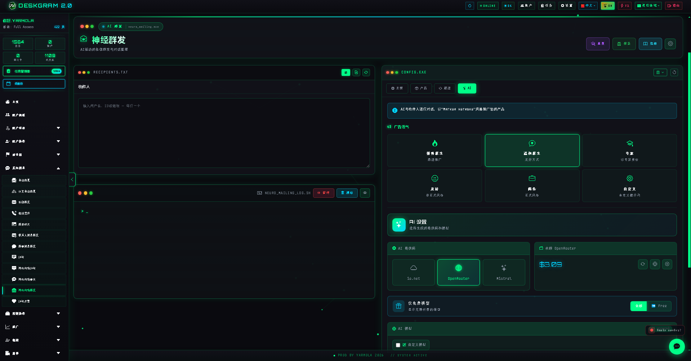

# Deskgram 2 神经私信

神经私信是 Deskgram 2 中用于 Telegram 私聊 AI 外联的模块。它不只是发送第一条消息，而是围绕产品目标、对话风格、跟进逻辑和转化动作，持续推进整段沟通流程，更适合需要“聊出来”的销售或线索转化场景。

[Deskgram 2 中文总览](https://github.com/Deskgram-2/deskgram-2-telegram-automation-zh) | [官网](https://deskgram2.com/) | [Telegram Bot](https://t.me/DG2welcomebot) | [Web Preview](https://deskgram2.com/web-preview?path=%2Fapp-demo%2Ffunctions%2Fneuromailing&lang=cn)

## 交互式 Web Preview

在浏览器中体验这个模块: [打开 Web Preview](https://deskgram2.com/web-preview?path=%2Fapp-demo%2Ffunctions%2Fneuromailing&lang=cn)

如果你想先判断这个模块是否适合当前业务，可以先打开 web preview，在浏览器里看清产品目标、跟进逻辑和 AI 设置，再决定是否继续安装和配置。

## 界面重点

### 主工作区

### 产品目标

### Follow-ups

### AI 设置

## 模块简介

| 参数 | 内容 |
|---|---|
| 核心任务 | 在 Telegram 私聊中执行 AI 对话式外联 |
| 主要区别 | 不止发第一条消息，而是推进完整对话链路 |
| 关键模块 | 产品信息、目标动作、跟进消息、AI 设置、账号分配 |
| 适用场景 | 获客、销售沟通、线索预热、资格筛选 |
| 关联模块 | 私信群发、自动回复、受众收集 |

## 模块能力

- 向 Telegram 私聊发送个性化首条消息；
- 按预设目标推动后续对话；
- 根据产品和场景调整语气、论点和表达顺序；
- 在用户沉默时自动发起 follow-up；
- 围绕一个明确目标动作持续沟通，例如回复、留资、点击或预约；
- 配合账号限速、延迟和执行规则一起工作；
- 记录回复质量、对话进度和转化信号。

## 快速开始

1. 准备好接收者基础名单。
2. 描述产品、目标动作和希望 AI 采用的沟通方式。
3. 配置 follow-up、排除规则和 AI 参数。
4. 分配账号、限速和执行节奏。
5. 启动任务并在任务层观察对话效果。

## 适合在什么情况下使用

- 当产品更适合通过对话而不是单条消息成交时；
- 当你更看重回复质量，而不是只看发送量时；
- 当你希望 AI 把用户从首次触达到目标动作逐步推进时；
- 当 follow-up 本身就是转化策略的一部分时。

## 启动前后适合接入哪些模块

- [受众收集](https://github.com/Deskgram-2/telegram-audience-parser-deskgram-zh)，如果接收者基础还没准备好；
- [账号面板](https://github.com/Deskgram-2/telegram-account-manager-deskgram-zh)，如果不同产品或不同路线要用不同账号组；
- [代理管理](https://github.com/Deskgram-2/telegram-proxy-manager-deskgram-zh)，如果长链路对话依赖更稳定的基础设施；
- [设置](https://github.com/Deskgram-2/telegram-automation-settings-deskgram-zh)，如果 сценарий 依赖共享 AI 或系统参数；
- [任务管理器](https://github.com/Deskgram-2/telegram-task-manager-deskgram-zh)，如果你想统一追踪执行、回复和错误；
- [自动回复](https://github.com/Deskgram-2/telegram-autoresponder-deskgram-zh)，如果用户回消息后还要继续通过后台回复层承接。

## 该选哪个：神经私信还是私信群发

| 如果你的目标是 | 更适合哪个 |
|---|---|
| 做结构清晰、批量可控的 Telegram 外联 | [私信群发](https://github.com/Deskgram-2/telegram-direct-messaging-deskgram-zh) |
| 在私聊里构建更强的 AI 对话链路 | [神经私信](https://github.com/Deskgram-2/telegram-neuro-mailing-deskgram-zh) |
| 先覆盖整批受众，再对高价值回复继续深聊 | 先私信群发，再神经私信 |
| 把 AI 对话和后续承接放进一条路线里 | 神经私信 + [自动回复](https://github.com/Deskgram-2/telegram-autoresponder-deskgram-zh) |

## 场景 FAQ

### 可以先看界面再决定是否安装吗？

可以。README 里已经放了直接 web preview 链接，你可以先在浏览器中查看产品区块、follow-up 逻辑和 AI 设置，再决定是否继续安装。

### 神经私信什么时候比普通外联更强？

当结果取决于对话本身，而不是只取决于第一条消息是否送达时，它会明显更强。尤其适合需要解释、说服、筛选和继续推进的场景。

### follow-up 是必须的吗？

不是必须，但通常很有价值。它能把沉默的潜在线索重新拉回对话，也能让整个转化路径更完整。

### 启动前最少要准备什么？

最少要准备受众基础、产品信息、目标动作和清晰的 AI 语气。然后再配置账号分配、限速和回复承接。

## 相关仓库

- [Deskgram 2 中文总览](https://github.com/Deskgram-2/deskgram-2-telegram-automation-zh)
- [私信群发](https://github.com/Deskgram-2/telegram-direct-messaging-deskgram-zh)
- [受众收集](https://github.com/Deskgram-2/telegram-audience-parser-deskgram-zh)
- [自动回复](https://github.com/Deskgram-2/telegram-autoresponder-deskgram-zh)
- [账号面板](https://github.com/Deskgram-2/telegram-account-manager-deskgram-zh)
- [代理管理](https://github.com/Deskgram-2/telegram-proxy-manager-deskgram-zh)
- [设置](https://github.com/Deskgram-2/telegram-automation-settings-deskgram-zh)
- [任务管理器](https://github.com/Deskgram-2/telegram-task-manager-deskgram-zh)

## 有用链接

- [Deskgram 2 官网](https://deskgram2.com/)
- [Deskgram 2 Telegram Bot](https://t.me/DG2welcomebot)
- [打开神经私信 Web Preview](https://deskgram2.com/web-preview?path=%2Fapp-demo%2Ffunctions%2Fneuromailing&lang=cn)

